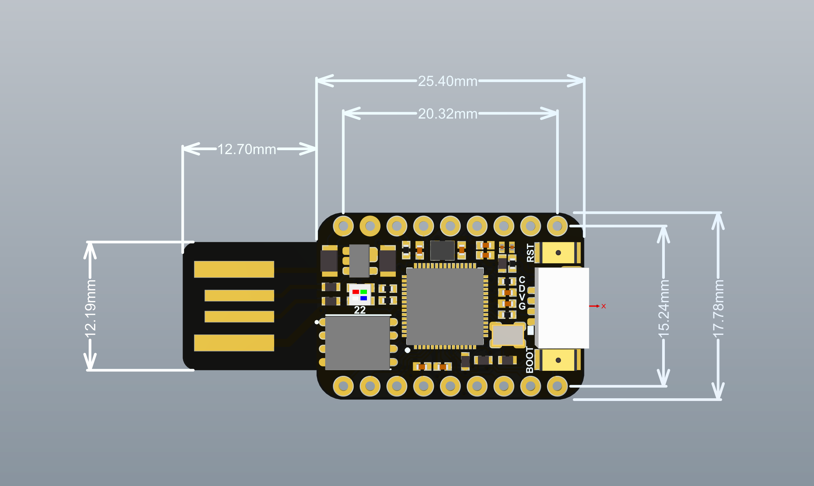
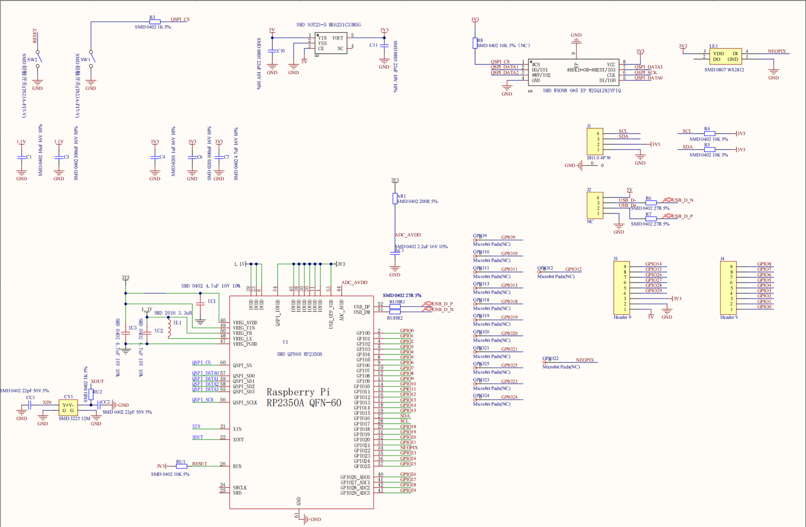

# BadUSB for nologo_usb

A Zephyr RTOS-based BadUSB application for the **nologo_usb** development boards.

## Hardware

The nologo_usb boards are compact USB-A development boards based on Raspberry Pi microcontrollers:

- **nologo_usb** — RP2040 [wiki](https://www.nologo.tech/product/raspberrypie/RP2040/rp2040usb/rp2040_usb1.html)
- **nologo_usb2** — RP2350A (Cortex-M33) [wiki](https://www.nologo.tech/product/raspberrypie/RP2350/rp2350usb/rp2350_usb1.html)



Key hardware features: built-in USB-A connector, WS2812 status LED (GPIO22), 2MB flash with FAT filesystem, and a script-disable safety pin (GPIO2).

<details>
<summary>Schematic</summary>


</details>

## Features

- **USB HID Keyboard** — Rubber Ducky script execution.
- **USB CDC ACM** — Serial communication with handshake/sync protocol.
- **USB MSC** — Mass storage (debug builds only; release uses flash directly).
- **WS2812 LED** — Green: USB serial ready, Red: init/error, Blue: keystroke.
- **GPIO2 Safety Pin** — Pull HIGH to disable script execution.
- **Flow Control** — `LOOP`/`ENDLOOP` blocks (nestable) and `GOTO`/`LABEL` jumps.

## Version

This project contains two versions setup.

- Debug
- Release(default)

The usb MSC(virtual u-disk) will only appear in debug mode. But all the files will stay in the device in release mode.

So, you can modify and test your config file in debug mode, while remain the file invisible and readable to the device.

BE AWARE, switching between debug and release mode requires re-burn your firmware.

This design is meant to protect config file and other sensitive data from being modified by any devices.

## Precompiled Firmware

Prebuilt UF2 files are available in the `firmware/` directory for immediate flashing:

| File | Board | Mode | USB MSC |
|---|---|---|---|
| `nologo_usb_release.uf2` | nologo_usb (RP2040) | Release | Disabled |
| `nologo_usb_debug.uf2` | nologo_usb (RP2040) | Debug | Enabled |
| `nologo_usb2_release.uf2` | nologo_usb2 (RP2350A) | Release | Disabled |
| `nologo_usb2_debug.uf2` | nologo_usb2 (RP2350A) | Debug | Enabled |

To flash: hold BOOT button, plug in USB, copy the `.uf2` file to the mounted drive.

## Build

Requires [Zephyr SDK](https://docs.zephyrproject.org/latest/develop/getting_started/index.html) and `west`.

```bash
# RP2040 (release / debug)
west build -p always -b nologo_usb badusb
west build -p always -b nologo_usb badusb -- -DCMAKE_BUILD_TYPE=Debug

# RP2350 (release / debug)
west build -p always -b nologo_usb2 badusb
west build -p always -b nologo_usb2 badusb -- -DCMAKE_BUILD_TYPE=Debug
```

Output: `build/zephyr/zephyr.uf2` — flash via UF2 (hold BOOT, plug in, copy file).

## Script Syntax

The device reads `/NAND:/config` on boot and executes it as HID keyboard commands after a 1-second delay. Syntax is Rubber Ducky-compatible with extensions.

| Command | Description |
|---|---|
| `REM <text>` | Comment |
| `DELAY <ms>` | Delay in milliseconds |
| `DEFAULT_DELAY <ms>` | Set delay applied after every command |
| `STRING_DELAY <ms>` | Set per-character typing delay (default 50ms, min 5ms) |
| `STRING <text>` | Type text |
| `STRINGLN <text>` | Type text + Enter |
| `LOOP <n>` / `ENDLOOP` | Repeat block n times (nestable up to 8 levels) |
| `LABEL <name>` / `GOTO <name>` | Jump to label (up to 32 labels) |
| `WAIT_HANDSHAKE [ms]` | Wait for CDC serial handshake |
| `WAIT_HOST [ms]` | Wait for host sync signal |
| `SIGNAL_HOST` | Send sync signal to host |

Standard keys (`ENTER`, `TAB`, `ESC`, `DELETE`, `F1`–`F12`, arrow keys, etc.) and modifier combinations (`GUI`, `CTRL`, `ALT`, `SHIFT`, `CTRL-ALT`, `CTRL-SHIFT`, etc.) are all supported.

### Example

```
DEFAULT_DELAY 50
DELAY 500
GUI r
DELAY 500
STRING notepad
ENTER
DELAY 1000
STRING Hello, World!
ENTER
```

See `badusb/examples/` for more scripts.

## Project Structure

```
badusb/               ← west workspace root (this directory)
├── badusb/           ← Zephyr application
│   ├── boards/nologo/    board definitions (nologo_usb, nologo_usb2)
│   ├── src/              application source
│   ├── examples/         sample Rubber Ducky scripts
│   ├── prj.conf          Kconfig (common / debug / release)
│   └── CMakeLists.txt
├── firmware/         ← precompiled UF2 firmware (debug & release)
├── bootloader/       ← MCUBoot
├── modules/          ← Zephyr modules (mbedtls, littlefs, etc.)
├── zephyr/           ← Zephyr kernel config & west.yml
└── doc/              ← hardware documentation
```
